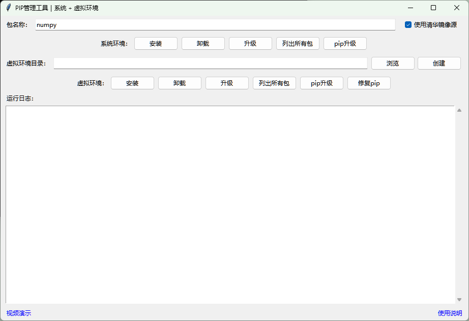

# PIP管理工具｜系统 + 虚拟环境 / PIP management tool | System + Virtual Environment
[English](#english) | [中文](#chinese)

---

### 项目简介
图形界面工具用于管理PIP包，替代手动命令行操作。

### 使用方法
1. 安装Python和Tkinter模块
2. 双击打开 `pip_tool.py`
3. 运行程序：系统环境可直接操作；虚拟环境需先浏览选择目标目录，点击按钮创建新虚拟环境

[软件介绍](https://www.baidu.com/)

---

### Project Introduction
A graphical tool for managing PIP packages, replacing manual command-line operations.

### Usage
1. Install Python and Tkinter modules
2. Double-click to open `pip_tool.py`
3. Run the program: system environment can be operated directly. For virtual environment, browse and select target folder first, then click to create new virtual environment.

[Software Introduction](https://www.baidu.com/)
